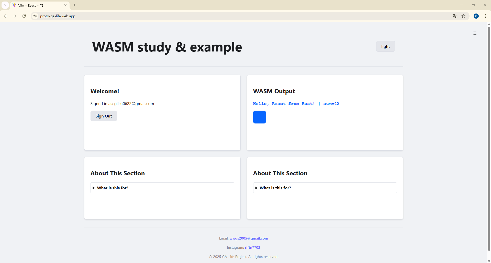

# React + Rust(WASM) 학습 프로젝트

이 프로젝트는 React, Rust(WASM), Firebase, AWS 배포 기술 스택을 학습하고 연습하기 위한 개인 프로젝트입니다. Vite를 기반으로 한 React 프론트엔드와 Rust로 작성된 WASM 모듈을 통합하고, Firebase 인증을 구현하며, 최종적으로는 AWS에 배포하는 전체 과정을 경험하는 것을 목표로 합니다.

자세한 개발 로드맵과 학습 과정에서 겪은 실수들은 `docs` 폴더에 기록되어 있습니다.

## 현재 구현된 화면


## ✨ 주요 기능

-   **Rust(WASM) 연동**: Rust로 작성된 함수(`add`, `hello` 등)를 React에서 호출
-   **반응형 레이아웃**: CSS Grid와 Flexbox를 사용한 반응형 UI
-   **테마 토글**: CSS 변수와 `localStorage`를 이용한 Light/Dark 모드 전환 및 유지
-   **Firebase 인증**: 이메일/비밀번호 및 Google 소셜 로그인을 통한 사용자 인증
-   **순수 CSS 네비게이션**: '체크박스 해킹' 기법을 이용한 사이드 메뉴

## 🛠️ 기술 스택

-   **Frontend**: `React`, `TypeScript`, `Vite`
-   **WASM**: `Rust`, `wasm-pack`, `wasm-bindgen`
-   **Authentication**: `Firebase Authentication`
-   **Styling**: `CSS3` (Grid, Flexbox, Variables)
-   **Deployment**: `Firebase Hosting` (현재), `AWS S3/CloudFront` (목표)
-   **Package Manager**: `yarn` (또는 `pnpm`/`npm`)

## 📁 프로젝트 구조

```

my-wasm-app/         # Vite 기반 React 애플리케이션
├─ src/
│  ├─ wasm/
│  │  ├─ pkg/         # wasm-pack 빌드 결과물
│  │  └─ index.ts     # WASM 모듈 로더
│  ...
├─ wasm-core/             # Rust 라이브러리 크레이트 (WASM 컴파일 대상)
│  └─ src/lib.rs
└─ docs/                  # 프로젝트 로드맵, 세션 로그, 실수 기록 등 문서
```

## 🚀 시작하기

1.  **의존성 설치** (`my-wasm-app` 폴더에서 실행)

    ```bash
    yarn install
    ```

2.  **WASM 모듈 빌드**

    ```bash
    yarn build:wasm
    ```

3.  **개발 서버 실행** (WASM 빌드 포함)

    ```bash
    yarn dev:full
    ```

4. **Firebase 호스팅 전 build**

    ```bash
    yarn build
    ```

5. **Firebase 임시 호스팅**

    ```bash
    firebase deploy --only hosting
    ```

## 🗺️ 학습 로드맵

본 프로젝트는 `docs/ROADMAP.md`에 정의된 단계별 학습 목표를 따라 진행됩니다.

-   **1단계**: Rust(WASM) ↔ React 기초 연동
-   **2단계**: HTML5 + CSS3 최신 기능 연습 (반응형 레이아웃, 테마)
-   **3단계**: Firebase Auth (로그인)
-   **4단계**: AWS 정적 배포 (S3, CloudFront)
-   **확장 목표**: WSL2 & Docker, 백엔드(NestJS), DB(PostgreSQL), Rhai 스크립팅 엔진 연동

## 📝 학습 기록

이 프로젝트의 핵심 목표는 '학습'입니다. 개발 과정에서 발생한 모든 실수와 해결 과정, 세션별 작업 내용은 `docs` 폴더에 상세히 기록하고 있습니다.

-   [세션 로그](./docs/session_logs.md)
-   [실수 및 해결 기록 1](./docs/mistakes/)
-   [실수 및 해결 기록 2](./docs/troubleshooting/firebase-auth-deep-dive.md)
-   [기본 로드맵](./docs/ROADMAP.md)
-   [확장 로드맵](./docs/ROADMAP_EXTENTION.md)
-   [향후 목표](./docs/GOAL.md)

## 임시 배포 URL
-   [WASM study & example](https://proto-ga-life.web.app/)